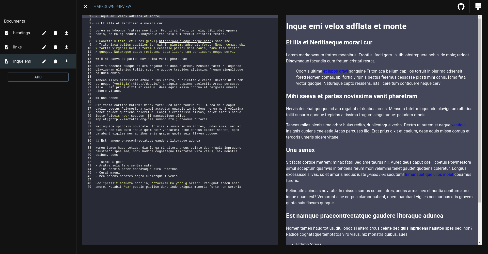

# Markdown Previewer

**Tier:** 2-Intermediate

Convert Github flavored markdown into HTML code.

## User Stories

- [x] User can enter Github flavored markdown into a `textarea`
- [x] ~~User can see the resulting `HTML` in another container/box by pressing on a button~~ It is done automatically when typing

## Bonus features

- [x] User can see the resulting `HTML` updated automatically when the markdown `textarea` is changed
- [x] When closing the browser window the markdown formatted text will be stored in `localStorage` and when the User returns, the data will be retrieved and displayed
- [x] User can click a button to download a markdown file
- [x] User can click a button to download a markdown file

## Useful links and resources

- [localStorage](https://developer.mozilla.org/en-US/docs/Web/API/Window/localStorage)
- [Markdown Guide](https://www.markdownguide.org/basic-syntax/)
- [Marked - A markdown parser](https://github.com/markedjs/marked)

## Example projects

- [Markdown Live Preview](https://markdownlivepreview.com/)

## Screenshots

# Template used

